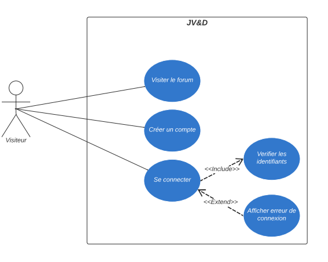
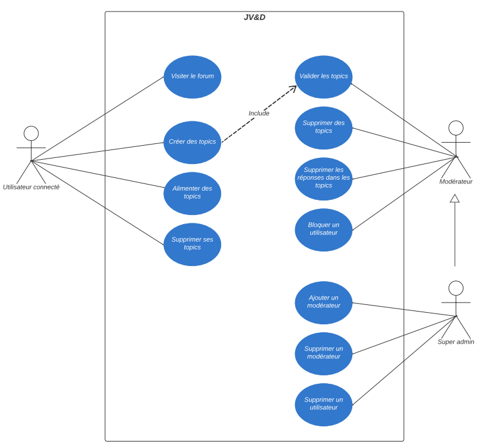
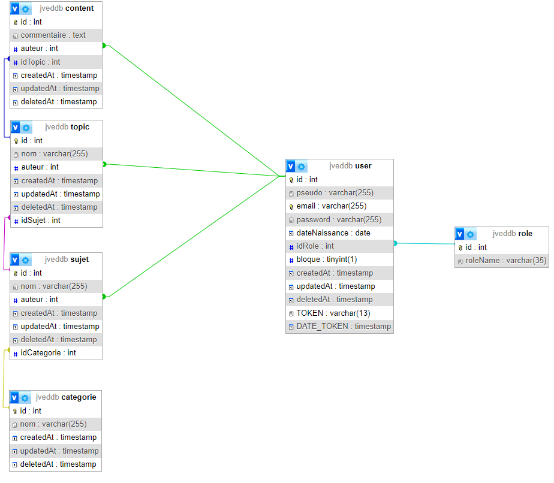
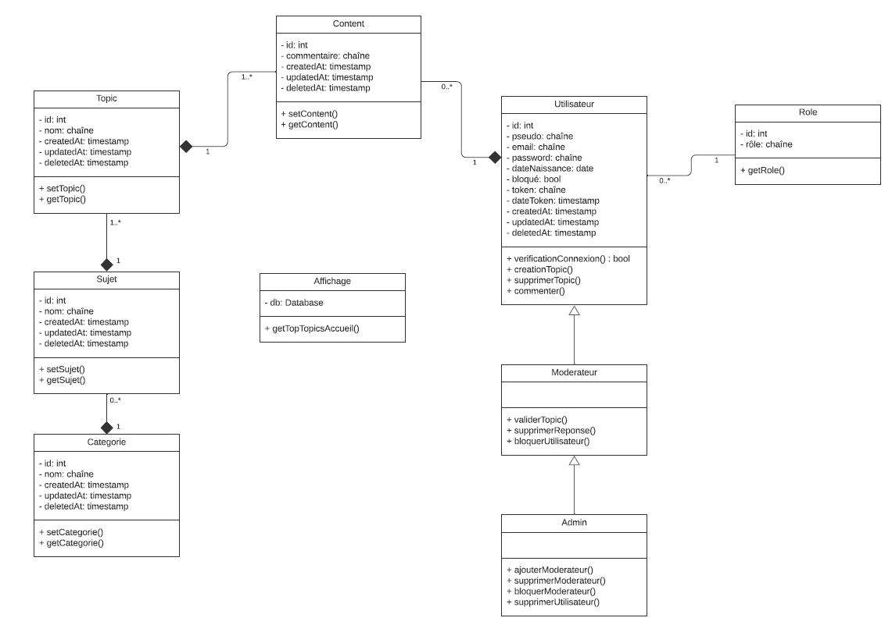

<h1 align="center">JV&D</h1>

# Guide d'utilisation du projet

Ce projet nécessite l'utilisation de Git Bash pour exécuter un script shell.

⚠️ **Ouvrir le terminal Git Bash depuis le dossier du projet :** Utilisez le terminal Git Bash en dehors de l'environnement VSCode pour éviter les erreurs de récupération de l'adresse IP du conteneur MailDev dans `config/config_mail.php`.

✅ Assurez-vous d'ouvrir Git Bash depuis le dossier racine du projet.

❌ **Évitez d'utiliser le terminal Git Bash dans VSCode**, car cela peut générer une erreur lors de la récupération de l'adresse IP du conteneur MailDev.

## Instructions

1. **Accéder au répertoire :** Utilisez la commande `cd` pour accéder au répertoire du projet (via Git Bash):

> cd chemin/vers/le/projet

2. **Exécuter le script :** Une fois dans le répertoire du projet, exécutez le script `deploy.sh` à l'aide de la commande suivante :

> ./deploy.sh

Assurez-vous que le script ait les permissions d'exécution. Si ce n'est pas le cas, vous pouvez utiliser la commande suivante pour lui donner les permissions nécessaires :

> chmod +x deploy.sh

3. **Suivre les instructions :** Le script lancera les conteneurs Docker nécessaires pour le projet et effectuera d'autres actions telles que la récupération de l'adresse IP du conteneur MailDev. Pour la définir en tant que constante.

4. **Accéder au projet :** Une fois que le script a terminé avec succès, vous pouvez accéder au projet via votre navigateur web :

> http://localhost:8080/

Accéder à MailDev :
> http://localhost:1080/#/

## 📸Diagrammes de cas d'utilisation

  

## 📸MCD

 

## 📸Diagramme de classe

 
