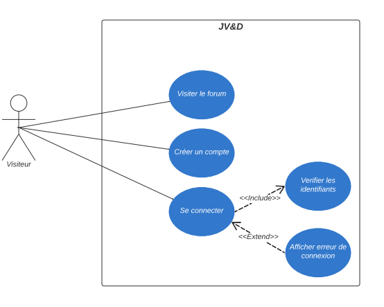
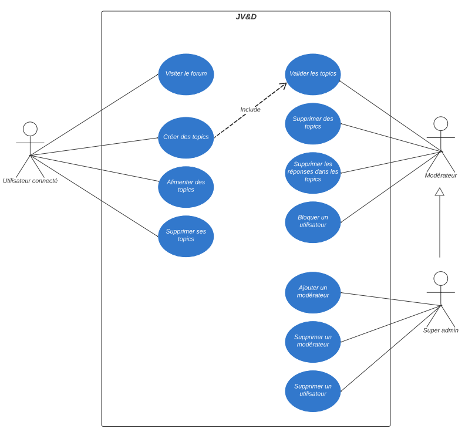
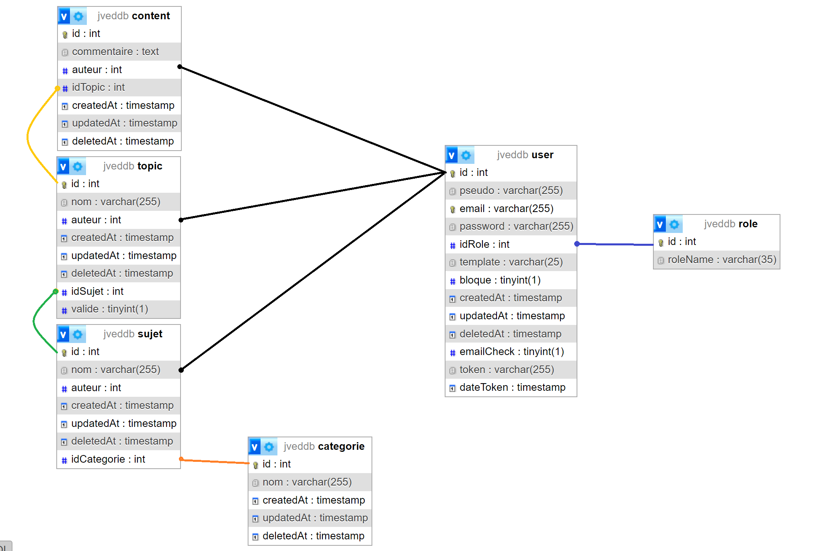
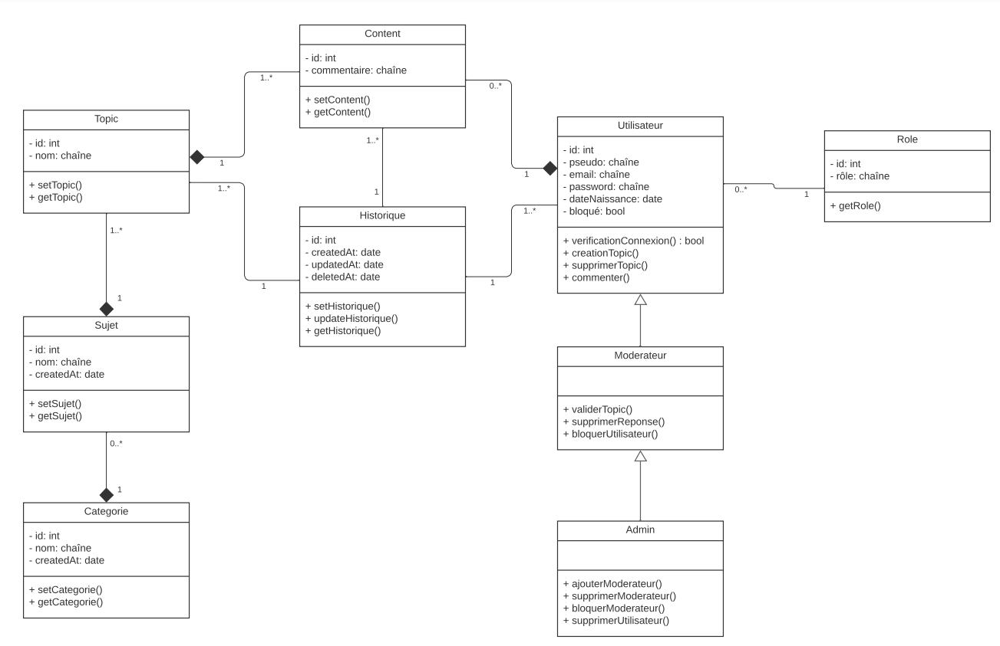

<h1 align="center">JV&D</h1>

<p align="center">Forum / CMS développé en PHP « from scratch » (sans framework), conteneurisé avec Docker.</p>

---

## 📖 Présentation

**JV&D** est une application web de type forum avec espace d'administration. Elle permet aux
utilisateurs de s'inscrire (avec vérification par email), de se connecter, de consulter des sujets
et des topics, et offre un **dashboard** pour gérer les contenus, catégories, utilisateurs et la
modération des publications.

Le projet est construit selon une architecture **MVC maison** : un unique point d'entrée
(`index.php`) reçoit toutes les requêtes et les distribue vers les bons contrôleurs grâce à un
routeur.

## 🧱 Stack technique

| Composant        | Technologie                          | Rôle |
|------------------|--------------------------------------|------|
| Langage          | **PHP 8.3** (php-fpm)                | Logique applicative |
| Serveur web      | **Nginx** (alpine)                   | Sert l'app et redirige vers php-fpm |
| Base de données  | **MySQL 8**                          | Persistance des données |
| Admin BDD        | **phpMyAdmin**                       | Interface d'administration de la base |
| Emails (dev)     | **MailDev**                          | Capture les emails (vérification de compte, reset password) |
| Templating       | **Twig**                             | Rendu des vues HTML |
| Routing          | **AltoRouter**                       | Association URL → contrôleur |
| Dépendances PHP  | **Composer**                         | Gestion des librairies (`vendor/`) |
| Styles           | **Sass / SCSS**                      | Génération de `style.css` |
| Conteneurisation | **Docker / Docker Compose**          | Orchestration de tous les services |

## 🗂️ Architecture du projet

```
.
├── index.php                # Front controller : reçoit toutes les requêtes
├── routes/routes.php        # Définition des routes (URL → contrôleur#méthode)
├── controllers/             # Contrôleurs (accueil, sécurité, posts, profil, dashboard)
├── models/                  # Accès BDD (PDO) + classes métier (user, topics, security…)
├── templates/               # Vues Twig
├── config/                  # Connexion BDD, config Twig, nginx, php.ini, MailDev
├── assets/                  # SCSS, images, JS
├── .github/bdd/             # Dumps SQL de la base (jveddb.sql = version courante)
├── docker-compose.yml       # Définition des conteneurs
├── Dockerfile               # Image PHP custom (extensions mysqli/pdo_mysql)
└── deploy.sh                # Script de démarrage (conteneurs + IP MailDev)
```

**Flux d'une requête :** `index.php` → `AltoRouter` trouve la route → instancie le contrôleur
correspondant (en lui injectant Twig, la connexion PDO et l'utilisateur en session) → le contrôleur
interroge les modèles → rend une vue Twig.

## ✅ Prérequis

- [Docker](https://www.docker.com/) et **Docker Compose** installés
- **Git Bash** (sous Windows) pour exécuter `deploy.sh`

> ⚠️ **Lancez Git Bash directement depuis le dossier du projet, en dehors de VSCode.** Le terminal
> intégré de VSCode peut échouer à récupérer l'adresse IP du conteneur MailDev écrite dans
> `config/config_mail.php`.

## 🚀 Installation & lancement

### 1. Cloner le dépôt

```bash
git clone https://github.com/Mart1n-S/JVED.git
cd JVED
```

### 2. Lancer le script de déploiement

```bash
chmod +x deploy.sh   # si besoin, pour donner les droits d'exécution
./deploy.sh
```

Ce script :
- démarre tous les conteneurs Docker (`docker-compose up -d`),
- récupère l'adresse IP du conteneur MailDev et l'écrit dans `config/config_mail.php`.

> 💡 **La base de données est importée automatiquement** au premier démarrage : le dump
> `.github/bdd/jveddb.sql` est monté dans `/docker-entrypoint-initdb.d/` du conteneur MySQL
> (schéma + données). Aucune action manuelle n'est nécessaire.

### 3. Accéder à l'application

| Service       | URL                                |
|---------------|------------------------------------|
| Application   | http://localhost:8080/             |
| phpMyAdmin    | http://localhost:8081/             |
| MailDev       | http://localhost:1080/#/           |

## 🔑 Identifiants par défaut

**Base de données** (définis dans `docker-compose.yml`) :

| Paramètre | Valeur   |
|-----------|----------|
| Hôte      | `mysql`  |
| Base      | `jveddb` |
| User      | `user`   |
| Password  | `password` |
| Root pwd  | `root`   |

## 🛠️ Dépannage

### `SQLSTATE[42S02] ... Table 'jveddb.topic' doesn't exist`

La base existe mais le schéma n'a pas été importé (cas des bases créées **avant** l'ajout de
l'import automatique). Deux solutions :

**Réinitialiser proprement** (recrée la base à partir du dump) :

```bash
docker-compose down -v   # ⚠️ supprime le volume dbdata (donc les données existantes)
./deploy.sh              # MySQL réimporte automatiquement jveddb.sql au démarrage
```

**Ou importer manuellement** sans tout recréer :

```bash
docker exec -i mysql-db mysql -uroot -proot < .github/bdd/jveddb.sql
```

> ℹ️ L'import automatique via `/docker-entrypoint-initdb.d/` ne se déclenche **que si le volume de
> données MySQL est vide**. Sur une base déjà initialisée, il faut donc passer par `down -v` ou
> par l'import manuel.

### Erreur d'IP MailDev

Vérifiez que vous lancez bien `deploy.sh` depuis **Git Bash hors VSCode** (voir Prérequis).

## 🎨 Développement des styles (SCSS)

Si vous modifiez les fichiers SCSS, lancez le watcher Sass pour régénérer `style.css` :

```bash
sass --watch assets/scss/index.scss style.css
```

## 📸 Documentation

### Diagrammes de cas d'utilisation

 <br>

### MCD

<br>

### Diagramme de classe

<br>
